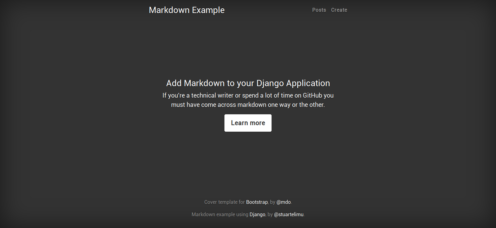

This is a simple project that allows you to view, create, update and delete posts. We are going to make an adjustment such that you can create posts using markdown syntax. 

#### Project setup
Clone or download this repository to a location on your machine. Change into the `markdown-example` directory with the following commad.

```
cd markdown-example
```

Create a virtual environment.

```
virtualenv env
```

Activate the virtual environment

```
source env/bin/activate
```

Install the packages from the requirements file

```
pip install -r requirements.txt
```

Rename `.env.example` to `.env`. You will generate a new secret key for your django project with a few lines.

Open the django shell, and type the following lines

```
from django.core.management.utils import get_random_secret_key

print(get_random_secret_key())
```
Open `.env` file and replace `s3cret` with the generated key. 

It's good practice to store sensitive variables to your project in environment variable or .env file which will be ignored when you push your code to github.

We can now make migrations to create our database. In the terminal type the following commands

```
./manage.py makemigrations post

./manage.py migrate
```

Once that's done you can start the development server and create, edit or delete a few posts

```
./manage.py runserver
```

You can follow this [article](http//goog.com) for the rest of the instructions.